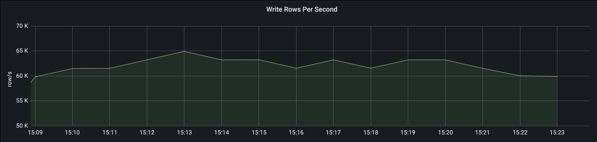
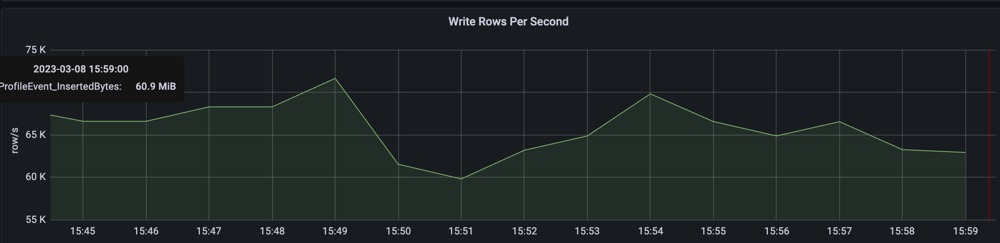
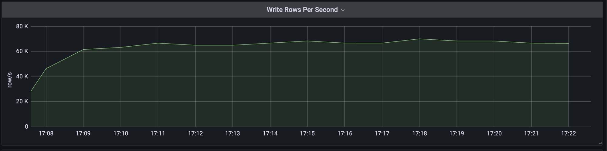

Clickhouse(以下简称ck)是战斗民族Yandex公司在2016年开源的专为在线数据分析而设计的高性能列式存储数据库，感兴趣的同学可以去ck官网学习一下。
由于在项目中的使用，需要支撑大流量下的ck写入，所以最近几天测试了一下使用go客户端的ck写入性能，主流的ck客户端有以下几种：

- clickhouse-go
- ch-go
- database/sql
- sqlx
- gorm

Clickhouse官方推荐了两种客户端，分别是clickhouse-go和ch-go，clickhouse-go是更高级别的api，但是选择哪种需要根据使用的模式和对性能的需求，对于每秒百万级别的插入，更推荐使用ch-go，对于低吞吐量和专注于数据分析来说，推荐使用前者。以下是ck官方文档中的一段话，可以参考一下。

> Selecting a client library depends on your usage patterns and need for optimal performance. For insert heavy use cases, where millions of inserts are required per second, we recommend using the low level client [ch-go](https://github.com/ClickHouse/ch-go). This client avoids the associated overhead of pivoting the data from a row-orientated format to columns, as the ClickHouse native format requires. Furthermore, it avoids any reflection or use of the `interface{}` (`any`) type to simplify usage.
>
> For query workloads focused on aggregations or lower throughput insert workloads, the [clickhouse-go](https://github.com/ClickHouse/clickhouse-go) provides a familiar `database/sql` interface and more straightforward row semantics. Users can also optionally use HTTP for the transport protocol and take advantage of helper functions to marshal rows to and from structs.

但开发不能单凭文档推荐，要根据实际情况，做性能测试之后，根据测试结果选择最优的方案。在做测试的过程中，笔者所用的go版本为1.19.6，因为clickhouse-go对go版本有要求：

| Client Version | Golang Versions |
| -------------- | --------------- |
| => 2.0 <= 2.2  | 1.17, 1.18      |
| \>= 2.3        | 1.18.4+, 1.19   |

***

## 性能测试

所有的测试都是用的同一个数据样本，单条数据1460字节大约1.4KB，数据库表字段689个，写入字段32个，每次最少写入80000条数据，因为ck官方说为了保证写入的性能，1KB左右的数据在5w-20w/s，不过写入的性能跟很多因素都挂钩，比如字段的多少，连接模式等等。用的测试机器是Linux系统，48核。测试结果我们用Grafana和Prometheus来监控。我们通过命令行参数的方式来来控制连接、数据量和协程数量等。

```go
	host = flag.String("host", "locakhouse:9000", "clickhouse host")
	user = flag.String("user", "root", "clichouse user")
	pass = flag.String("password", "123456", "clickhouse password")
	db = flag.String("db", "test", "clickhouse database")
	g = flag.Int("g", 1, "write goroutine")
	batch = flag.Int("batch", 100000, "clickhouse batch")
	tb = flag.String("tb", "event", "clickhouse table")
	debug = flag.Bool("debug", false, "clickhouse debug")
	flag.Parse()
```

### [Clickhouse-go](https://github.com/ClickHouse/clickhouse-go)

clickhouse-go有两个版本v1和v2，从官方benchmark结果来看，v2版本的性能要比v1版本的性能好，本着用新不用旧的原则😄，我们直接用v2版本的开始测试。有两种批量写入方式，一种是本机的api，一种是通过字段映射批量写入，我们先来看第一种方式。

#### Write by clickhouse api

首先需要建立连接，然后根据命令行参数启动写入的协程：

```go
	conn, err := clickhouse.Open(&clickhouse.Options{
		Addr: []string{*host},
		Auth: clickhouse.Auth{
			Database: *db,
			Username: *user,
			Password: *pass,
		},
		Settings: clickhouse.Settings{
			"max_execution_time": 60,
		},
		MaxOpenConns: 50,
		MaxIdleConns: 10,
		DialTimeout:  5 * time.Second,
		Debug:        *debug,
	})
	if err != nil {
		panic(any(err))
	}
	if err := conn.Ping(context.Background()); err != nil {
		panic(any(err))
	}
	for i:=0; i<*g; i++ {
		go func() {
			for {
				insert(conn, *batch)
			}
		}()
	}
```

写入的过程也比较简单，首先需要解析我们的插入语句得到一个batch，然后将这一批的数据追加到batch中，最后通过Send方法将数据写入到ck，总体来说真正的写入是在Send中实现的，在此之前的操作都会放到内存中处理。最后通过整体用时跟数据量计算得出一个速率。

```go
func insert(conn driver.Conn, batch int) {
	start := time.Now().UnixNano()
	ctx := context.Background()
	bt, err := conn.PrepareBatch(ctx, data.InsertSql)
	if err != nil {
		log.Fatal(err)
	}
	s := time.Now().UnixNano()
	for i := 0; i < batch; i++ {
		err := bt.Append(data.InsertData.Ccollectorip, data.InsertData.Cdevip, data.InsertData.Cdevtype, data.InsertData.Cdstip, data.InsertData.Ceventmsg,
			data.InsertData.Ceventname, data.InsertData.Ceventtype, data.InsertData.Cflowdir, data.InsertData.Cobject, data.InsertData.Coperation,
			data.InsertData.Csrcip, data.InsertData.Csrclogtype, data.InsertData.LogypeTag, data.InsertData.Manufacturer, data.InsertData.Reason,
			data.InsertData.Iappprotocol, data.InsertData.Icollecttype, data.InsertData.Idstport, data.InsertData.Ieventlevel, data.InsertData.Imergecount,
			data.InsertData.Iprotocol, data.InsertData.Isrcport, data.InsertData.Lduration, data.InsertData.Lrecivepack, data.InsertData.Lsendpack,
			data.InsertData.RequestBodyLen, data.InsertData.ResponseBodyLen, data.InsertData.Lendtime, data.InsertData.Lid, time.Now().UnixNano()/1e9,
			data.InsertData.Lrecepttime, data.InsertData.Lstartime)
		if err != nil {
			log.Fatal(err)
		}
	}
	e := time.Now().UnixNano()
	bt.Send()
	end := time.Now().UnixNano()
	fmt.Printf("记录数: %d, 耗时: %d, 循环准备耗时: %d, 速率: %d(条/秒) \n", batch, (end-start)/1e6, (e-s)/1e6, int64(batch*1000000*1000)/(end-start))
}
```

测试结果：


从打印结果来看差不多速率在6w-7w/s之间，再来看一下grafana也是平均6.5w/s左右。



最终结果：单线程下，clickhouse-go的写入速率在6w/s。

#### Write by column

连接跟之前都是一样的，写入的处理略有区别，需要预先定义插入字段的类型，我们提前将数据放到定义好的字段中。

```go
var (
	ccollectorip, cdevip, cdevtype, cdstip, ceventmsg, ceventname, ceventtype, cflowdir, cobject, coperation, csrcip, csrclogtype,
	logtype_tag, manufacturer, reason []string
	iappprotocol, icollecttype, idstport, ieventlevel, imergecount, iprotocol, isrcport                                       []int32
	lduration, lrecivepack, lsendpack, request_body_len, response_body_len, lendtime, lid, loccurtime, lrecepttime, lstartime []int64
)

for i := 0; i < *batch; i++ {
		ccollectorip = append(ccollectorip, data.InsertData.Ccollectorip)
		cdevip = append(cdevip, data.InsertData.Cdevip)
		cdevtype = append(cdevtype, data.InsertData.Cdevtype)
		cdstip = append(cdstip, data.InsertData.Cdstip)
		ceventmsg = append(ceventmsg, data.InsertData.Ceventmsg)
		ceventname = append(ceventname, data.InsertData.Ceventname)
		ceventtype = append(ceventtype, data.InsertData.Ceventtype)
		cflowdir = append(cflowdir, data.InsertData.Cflowdir)
		cobject = append(cobject, data.InsertData.Cobject)
		coperation = append(coperation, data.InsertData.Coperation)
		csrcip = append(csrcip, data.InsertData.Csrcip)
		csrclogtype = append(csrclogtype, data.InsertData.Csrclogtype)
		logtype_tag = append(logtype_tag, data.InsertData.LogypeTag)
		manufacturer = append(manufacturer, data.InsertData.Manufacturer)
		reason = append(reason, data.InsertData.Reason)
		iappprotocol = append(iappprotocol, data.InsertData.Iappprotocol)
		icollecttype = append(icollecttype, data.InsertData.Icollecttype)
		idstport = append(idstport, data.InsertData.Idstport)
		ieventlevel = append(ieventlevel, data.InsertData.Ieventlevel)
		imergecount = append(imergecount, data.InsertData.Imergecount)
		iprotocol = append(iprotocol, data.InsertData.Iprotocol)
		isrcport = append(isrcport, data.InsertData.Iprotocol)
		lduration = append(lduration, data.InsertData.Lduration)
		lrecivepack = append(lrecivepack, data.InsertData.Lrecivepack)
		lsendpack = append(lsendpack, data.InsertData.Lsendpack)
		request_body_len = append(request_body_len, data.InsertData.RequestBodyLen)
		response_body_len = append(response_body_len, data.InsertData.ResponseBodyLen)
		lendtime = append(lendtime, data.InsertData.Lendtime)
		lid = append(lid, data.InsertData.Lid)
		loccurtime = append(loccurtime, data.InsertData.Loccurtime)
		lrecepttime = append(lrecepttime, data.InsertData.Lrecepttime)
		lstartime = append(lstartime, data.InsertData.Lstartime)
	}
```

写入的时候也是需要先解析为batch，然后再将我们预先定义好的字段映射到batch的column上，最后再通过Send写入到ck。

```go
func insert(conn driver.Conn, batch int) {
	start := time.Now().UnixNano()
	ctx := context.Background()
	bt, err := conn.PrepareBatch(ctx, data.InsertSql)
	if err != nil {
		log.Fatal(err)
	}
	s := time.Now().UnixNano()

	bt.Column(0).Append(ccollectorip)
	bt.Column(1).Append(cdevip)
	bt.Column(2).Append(cdevtype)
	bt.Column(3).Append(cdstip)
	bt.Column(4).Append(ceventmsg)
	bt.Column(5).Append(ceventname)
	bt.Column(6).Append(ceventtype)
	bt.Column(7).Append(cflowdir)
	bt.Column(8).Append(cobject)
	bt.Column(9).Append(coperation)
	bt.Column(10).Append(csrcip)
	bt.Column(11).Append(csrclogtype)
	bt.Column(12).Append(logtype_tag)
	bt.Column(13).Append(manufacturer)
	bt.Column(14).Append(reason)
	bt.Column(15).Append(iappprotocol)
	bt.Column(16).Append(icollecttype)
	bt.Column(17).Append(idstport)
	bt.Column(18).Append(ieventlevel)
	bt.Column(19).Append(imergecount)
	bt.Column(20).Append(iprotocol)
	bt.Column(21).Append(isrcport)
	bt.Column(22).Append(lduration)
	bt.Column(23).Append(lrecivepack)
	bt.Column(24).Append(lsendpack)
	bt.Column(25).Append(request_body_len)
	bt.Column(26).Append(response_body_len)
	bt.Column(27).Append(lendtime)
	bt.Column(28).Append(lid)
	bt.Column(29).Append(loccurtime)
	bt.Column(30).Append(lrecepttime)
	bt.Column(31).Append(lstartime)
	e := time.Now().UnixNano()
	bt.Send()
	end := time.Now().UnixNano()
	fmt.Printf("记录数: %d, 耗时: %d, 循环准备耗时: %d, 速率: %d(条/秒) \n", batch, (end-start)/1e6, (e-s)/1e6, int64(batch*1000000*1000)/(end-start))
}
```

测试结果：




从测试结果来看，ck的写入速度差不多在每秒6w到7万之间，平均在6.5w/s，对比本机的api测试结果略有提升，这是为什么呢？在扒了一些文档和看了一下底层带吗后，发现通过字段写入这样做的好处是避免了行列的转换，我们都知道ck是一个列式存储数据库，并且因为我们预先定义好了字段的类型，在数据处理上也避免了一些类型判断和反射。

### [ch-go](https://github.com/ClickHouse/ch-go)

建立连接都是大同小异，我们就不在细看了，直接来看写入的阶段

```go
func insert(conn *ch.Client, batch int) {
	start := time.Now().UnixNano()
	var (
		ccollectorip, cdevip, cdevtype, cdstip, ceventmsg, ceventname, ceventtype, cflowdir, cobject, coperation, csrcip, csrclogtype,
		logtype_tag, manufacturer, reason proto.ColStr
		iappprotocol, icollecttype, idstport, ieventlevel, imergecount, iprotocol, isrcport                                       proto.ColInt32
		lduration, lrecivepack, lsendpack, request_body_len, response_body_len, lendtime, lid, loccurtime, lrecepttime, lstartime proto.ColInt64
	)
	for i := 0; i < batch; i++ {
		ccollectorip.Append(data.InsertData.Ccollectorip)
		cdevip.Append(data.InsertData.Cdevip)
		cdevtype.Append(data.InsertData.Cdevtype)
		cdstip.Append(data.InsertData.Cdstip)
		ceventmsg.Append(data.InsertData.Ceventmsg)
		ceventname.Append(data.InsertData.Ceventname)
		ceventtype.Append(data.InsertData.Ceventtype)
		cflowdir.Append(data.InsertData.Cflowdir)
		cobject.Append(data.InsertData.Cobject)
		coperation.Append(data.InsertData.Coperation)
		csrcip.Append(data.InsertData.Csrcip)
		csrclogtype.Append(data.InsertData.Csrclogtype)
		logtype_tag.Append(data.InsertData.LogypeTag)
		manufacturer.Append(data.InsertData.Manufacturer)
		reason.Append(data.InsertData.Reason)
		iappprotocol.Append(data.InsertData.Iappprotocol)
		icollecttype.Append(data.InsertData.Icollecttype)
		idstport.Append(data.InsertData.Idstport)
		ieventlevel.Append(data.InsertData.Ieventlevel)
		imergecount.Append(data.InsertData.Imergecount)
		iprotocol.Append(data.InsertData.Iprotocol)
		isrcport.Append(data.InsertData.Isrcport)
		lduration.Append(data.InsertData.Lduration)
		lrecivepack.Append(data.InsertData.Lrecivepack)
		lsendpack.Append(data.InsertData.Lsendpack)
		request_body_len.Append(data.InsertData.RequestBodyLen)
		response_body_len.Append(data.InsertData.ResponseBodyLen)
		lendtime.Append(data.InsertData.Lendtime)
		lid.Append(data.InsertData.Lid)
		loccurtime.Append(data.InsertData.Loccurtime)
		lrecepttime.Append(data.InsertData.Lrecepttime)
		lstartime.Append(data.InsertData.Lstartime)
	}
	input := proto.Input{
		{Name: "ccollectorip", Data: &ccollectorip},
		{Name: "cdevip", Data: &cdevip},
		{Name: "cdevtype", Data: &cdevtype},
		{Name: "cdstip", Data: &cdstip},
		{Name: "ceventmsg", Data: &ceventmsg},
		{Name: "ceventname", Data: &ceventname},
		{Name: "ceventtype", Data: &ceventtype},
		{Name: "cflowdir", Data: &cflowdir},
		{Name: "cobject", Data: &cobject},
		{Name: "coperation", Data: &coperation},
		{Name: "csrcip", Data: &csrcip},
		{Name: "csrclogtype", Data: &csrclogtype},
		{Name: "logtype_tag", Data: &logtype_tag},
		{Name: "manufacturer", Data: &manufacturer},
		{Name: "reason", Data: &reason},
		{Name: "iappprotocol", Data: &iappprotocol},
		{Name: "icollecttype", Data: &icollecttype},
		{Name: "idstport", Data: &idstport},
		{Name: "ieventlevel", Data: &ieventlevel},
		{Name: "imergecount", Data: &imergecount},
		{Name: "iprotocol", Data: &iprotocol},
		{Name: "isrcport", Data: &isrcport},
		{Name: "lduration", Data: &lduration},
		{Name: "lrecivepack", Data: &lrecivepack},
		{Name: "lsendpack", Data: &lsendpack},
		{Name: "request_body_len", Data: &request_body_len},
		{Name: "response_body_len", Data: &response_body_len},
		{Name: "lendtime", Data: &lendtime},
		{Name: "lid", Data: &lid},
		{Name: "loccurtime", Data: &loccurtime},
		{Name: "lrecepttime", Data: &lrecepttime},
		{Name: "lstartime", Data: &lstartime},
	}
	s := time.Now().UnixNano()
	if err := conn.Do(context.Background(), ch.Query{
		Body:  insertSql,
		Input: input,
	}); err != nil {
		log.Fatal(err)
	}
	end := time.Now().UnixNano()
	fmt.Printf("记录数: %d, 耗时: %d, 循环准备耗时: %d, 速率: %d(条/秒) \n", batch, (end-start)/1e6, (s-start)/1e6, int64(batch*1000000*1000)/(end-start))
}
```

写入的处理看起来跟clickhouse-go的字段写入很像，也是先定义好了数据结构，把结构和字段映射到一起，最终通过Do的方法写入ck。

测试结果：




ch-go的写入性能跟clickhouse-go的性能很接近，也是平均6.7w-6.8w/s，但是ch-go的写入速率非常平稳，相比来看，在大数据量写入的情况下ch-go是比较稳定的。

### [database/sql](database/sql)

sql库在连接ck的时候需要一个ck的引擎，用的也是clickhouse-go的引擎，本来享用v2版本进行测试，但是在连接的过程中出现了这个报错：

***code: 81, message: Database default doesn't exist***

即使数据库怎在也会报这个错误，所以在进行测试的时候选了v1版本的clickhouse-go引擎，从连接看就能够知道使用了clickhouse-go的引擎，写入的时候是使用了事务。

```go
	conn := clickhouse.OpenDB(&clickhouse.Options{
		Addr: []string{*host},
		Auth: clickhouse.Auth{
			Database: *db,
			Username: *user,
			Password: *pass,
		},
		Settings: clickhouse.Settings{
			"max_execution_time": 60,
		},
		DialTimeout: 5 * time.Second,
		Debug:       true,
	})
```

```go
func insert(conn *sql.DB, batch int) {
	start := time.Now().UnixNano()
	tx, err := conn.Begin()
	if err != nil {
		log.Fatal(err)
	}
	stmt, err := tx.Prepare(data.InsertSql)
	if err != nil {
		log.Fatal(err)
	}
	s := time.Now().UnixNano()
	for i := 0; i < batch; i++ {
		_, err := stmt.Exec(data.InsertData.Ccollectorip, data.InsertData.Cdevip, data.InsertData.Cdevtype, data.InsertData.Cdstip, data.InsertData.Ceventmsg,
			data.InsertData.Ceventname, data.InsertData.Ceventtype, data.InsertData.Cflowdir, data.InsertData.Cobject, data.InsertData.Coperation,
			data.InsertData.Csrcip, data.InsertData.Csrclogtype, data.InsertData.LogypeTag, data.InsertData.Manufacturer, data.InsertData.Reason,
			data.InsertData.Iappprotocol, data.InsertData.Icollecttype, data.InsertData.Idstport, data.InsertData.Ieventlevel, data.InsertData.Imergecount,
			data.InsertData.Iprotocol, data.InsertData.Isrcport, data.InsertData.Lduration, data.InsertData.Lrecivepack, data.InsertData.Lsendpack,
			data.InsertData.RequestBodyLen, data.InsertData.ResponseBodyLen, data.InsertData.Lendtime, data.InsertData.Lid, data.InsertData.Loccurtime,
			data.InsertData.Lrecepttime, data.InsertData.Lstartime)
		if err != nil {
			log.Fatal(err)
		}
	}
	e := time.Now().UnixNano()
	tx.Commit()
	stmt.Close()
	end := time.Now().UnixNano()
	fmt.Printf("记录数: %d, 耗时: %d, 循环准备耗时: %d, 速率: %d(条/秒) \n", batch, (end-start)/1e6, (e-s)/1e6, int64(batch*1000000*1000)/(end-start))
}
```

测试结果：


从测试结果来看，每秒写入的速度平均为5.5w/s，消耗时间多的地方在Exec的方法上，也就是数据处理上。

### [sqlx](https://github.com/jmoiron/sqlx)

sqlx是在标准库database/sql上进行了扩展，提供了自己的一些查询或事务的方法，连接也非常简单。

```go
	conn, err := sqlx.Connect("clickhouse", fmt.Sprintf("tcp://%s?username=%s&password=%s&database=%s&debug=false", *host, *user, *pass, *db))
	if err != nil {
		panic(any(err))
	}
```

数据的写入就跟database/sql是一样的，所以性能跟其很像，在这就不多做赘述了，有兴趣的可以自行研究一下。

### [Gorm](https://github.com/go-gorm/gorm)

gorm是一个应用广泛的golang orm框架，因其功能全，支持原生sql，文档健全而备受好评，接下来我们看一下gorm在ck写入方面的性能如何。gorm的连接和写入也非常简单和暴力，就一个Creat方法就搞定，对于开发人员来说，更加喜欢这种简洁只记得方式。

```go
	dsn := fmt.Sprintf("clickhouse://%s:%s@%s/%s", *user, *pass, *host, *db)
	db, err := gorm.Open(clickhouse.Open(dsn), &gorm.Config{})
	if err != nil {
		panic(any(err))
	}
```

```go
func insert(db *gorm.DB, batch int) {
	start := time.Now().UnixNano()
	result := make([]data.Data, 0, batch)
	for i := 0; i < 100000; i++ {
		result = append(result, data.InsertData)
	}
	db.Table("event").Create(&result)
	end := time.Now().UnixNano()
	fmt.Printf("记录数: %d, 耗时: %d, 速率: %d(条/秒) \n", 100000, (end-start)/1e6, int64(100000*1000000*1000)/(end-start))

}
```

测试结果：


从测试结果来看，gorm的ck写入性能却不尽人意，只能做到4w/s，不过也没有对gorm抱有太大希望，因为gorm的优势在于便利的api，在项目中也用gorm对mysql进行查询和写入，也是非常丝滑，性能并没有什么问题。对于ck性能低，也许是跟gorm的ck社区不是很活跃，关注的重点不在这上面。

## 测试结果

| clickhouse-go   | ch-go  | database/sql | Sql  | grom |
| --------------- | ------ | ------------ | ---- | ---- |
| 6.5w/s (column) | 6.7w/s | 5.5w/s       | 6w/s | 4w/s |

## 结论

从以上的测试结果来看，官方推荐的clickhouse-go和ch-go更具有优势，所以选择其中任意一种均可，但如果在字段数量小的情况下，笔者任务ch-go的写入更具有优势，毕竟clickhouse-go更专注于低吞吐量和数据分析查询。因此这两个库需要看自己的使用而定。

以上测试并不代表任何情况下的ck写入性能，具体情况还需要自己亲自试过才要决定。
